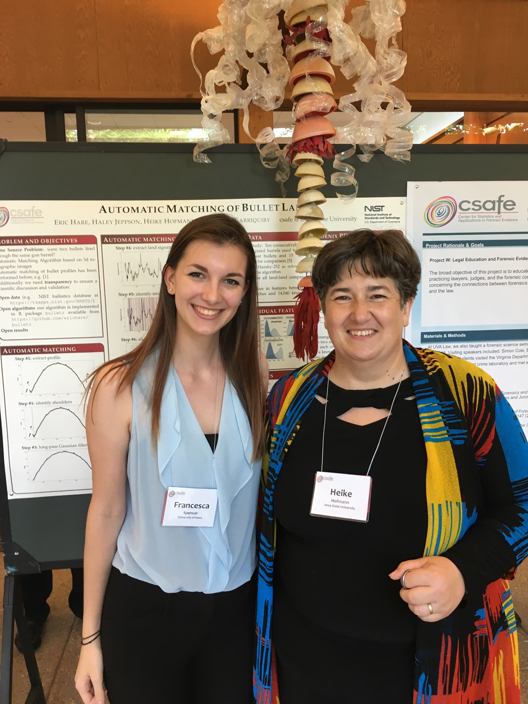

## 1pm Session: Blood Pattern Analysis

During this discussion, terms like the String Method and fluid dynamics and the area of convergence and origin were thrown out there and I personally wasn't sure whether these came from a statistics or forensics background (except for fluid dynamics, I've heard of that before). Because I had never heard of these methods or measurements before, I kind of had to work backwards and figure out through context what they meant. One statistical method that stood out was when Dr. Attinger stated what he would like to come out of his work as that is being able to have an answer to "What is the probability of a certain blood spatter pattern being the result of a gunshot or a beating?"
As a full-time researcher with CSAFE, I would love to work on this blood pattern analysis project (the only project discussed in this group) because it interests me and I've worked on a part of this project two years ago. Blood spatter interests me partially because it's so diverse in how it can end up on a wall or floor and partially because the data collection for this project sounds like a lot of fun.
Future work that was mentioned was testing how blood that lands on fabric affects the resulting pattern. Another type of future work that was suggested by a professor of statistics was to create a database to compare blood spatter patterns in order to more easily identify blood spatter at a crime scene, which I found to be an impossible feat because every blood spatter pattern is unique and not exactly comparable. A main hole this project aims to fill is being able to conclusively determine (or at least as conclusively as possible) whether a certain blood pattern is the result of a shooting or a beating, since these two look relatively similar.
Future work that I would propose is testing different surfaces for the blood to land on, not necessarily fabric and the even surface they currently use. For example, blood on snow and blood on rocks react differently and conclusively testing to see how those are different would be helpful I think.
The coolest/most intriguing thing I learned in this session was that people are actually being taught incorrectly in regards to blood spatter. Someone who works at the crime lab in Ankeny explained how he was taught to find the area of convergence and origin and Dr. Attinger explained that it was incorrect because it doesn't take into account the fact that when something flies through the air, it doesn't travel in a straight line, rather it curves as it travels.

## 3:15pm Session: Firearms/Handwriting

During this discussion, pairwise correlations and the repeatability of data were two things that were brought up multiple times in reference to all three projects in this group. Both the bullet striae and handwriting features use these methods to compare whether or not two things came from the same source or different sources. Repeatability was a big thng for these projects because making these analyses objective requires the programs comparing the samples to be reliably repeatable.
As a full-time researcher with CSAFE I would love to work on the bullet matching project because I have worked on this project before, but more on the "intern" side of things, such as labelling the bags the bullets would go in and organizing the bullets by number. I would like to be able to see another side of this project, possibly the data collection side, to see another side of experiments that I haven't seen or experienced first-hand.
Future work that was mentioned was for the handwriting project and comparing multiple features of a signature instead of single features. From what I understood, what are described as "features" in reference to a signature are turning points, crossings, and intersections. From what I understood, a hole this handwriting project aims to fill is working to determine whether a signature has been forged, possibly from a computer program, or is the owner's actual signature.
Future work I would propose to the bullets project would maybe be to develop a part of their current program that factors in and removes from the analysis environmental factors such as dirt and mud that may get on the bullets and casings since these things most likely won't be kept very clean at an actual crime scene.
The coolest/most intriguing thing that I learned from this discussion session was more of how the program for the handwriting project works to match signatures, since it can't necessarily be superimposed because signatures may vary in size and length although they come from the same source.

## Poster Session: Automatic Matching of Bullet Lands

At the poster session, I talked with Heike Hofmann from Iowa State University. Dr. Hofmann's research question was "Were two bullets fired through the same gun barrel?" One result Dr. Hofmann shared with me is the correlation tree she was able to put together from her results that stated that lots of matches and lots of cross correlation means that two bullets are a match, and the opposite is true for a non-match. One question I asked was how the graphs and tree on her poster relate to each other and after she explained it while pointing to specific data, it made sense in my head, but I don't think I could reiterate that relation because it involved relationships I don't quite understand yet.

