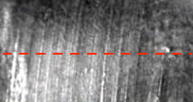
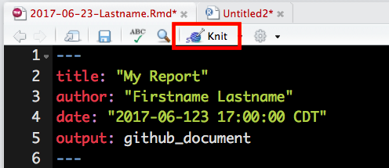

My Report
================
Firstname Lastname
2017-06-123 17:00:00 CDT

Introduction
------------

This report contains my data analysis of a scan of a bullet. This data is stored in the file [bullet.csv](./bullet.csv). The data I analyze is one crosscut of a 3D bullet scan at the micrometer level. The red dotted line in the image below shows an example of a bullet crosscut like the one I analyze. To better understand this data, I looked at a plot of it.



Plot
----

This is my plot. On the *x*-axis, I put the "y" value in my data set. This "y" value is the horizontal position (on the red dotted line) in the image above. On the *y*-axis in my plot, I put the "resid" value in my data set. This "resid" value represents the depth of the striation marks in the bullet. Recall that these values are all measured in micrometers (*μ*m).

``` r
# In the brackets above, delete `eval = FALSE` before clicking `knit`
library(ggplot2)
library(readr)
bullet <- read.cvs("bullet.csv")
head(bullet)
ggplot(data = bullet) + 
  geom_line(aes(x= y, y = resid))
```

Summarizing my data
-------------------

That was a very pretty plot! Let's look at a summary of the data:

``` r
# In the brackets above, delete `eval = FALSE` before clicking `knit`
summary(bullet)
```

One more plot
-------------

Finally, I look for outliers in the data. Outliers are typically defined as values greater than two standard deviations above the mean, and as values less than two standard deviations below the mean.

``` r
# In the brackets above, delete `eval = FALSE` before clicking `knit`
library(tidyr)
myLines <- data.frame(meanValue = mean(bullet$resid), 
           OutliersAtLeft = mean(bullet$resid) - 2*sd(bullet$resid),
           OutliersAtRight = mean(bullet$resid) + 2*sd(bullet$resid))
myLines <- myLines %>% gather(id, value)
ggplot() + 
  geom_histogram(data = bullet, aes(x = resid), binwidth = .25) + 
  geom_vline(data = myLines, aes(xintercept = value), color = 'red') +
  geom_label(data = myLines, aes(x = value, y = 100, label = id))
  ggtitle("Histrogram Showing the Distribution of")
```

This was a great learning experience about bullets!

Assignment Instructions (Read carefully, please!)
=================================================

This file `2017-06-23-Lastname.Rmd` is a reproducible report created by a fictional student named Firstname Lastname. Unfortunately, they aren't a very good student, and submitted an assignment with a lot of `R` code errors. Your assignment is to fix their code and re-run their report.

To complete this assignment, download the `2017-06-23-Lastname.Rmd`, `striations.jpg`, and `bullet.csv` files and open the `.Rmd` with RStudio. Copy-paste the contents of the `.Rmd` into a *new* `.Rmd`, and name it the same way, replacing all instances of Firstname with your first name and all instances of Lastname with your last name. You can also change the title to something a bit more creative than "My Report".

Delete this instructions section in your document, fix the errors in the document, and knit it. When you click on the `knit` button (see below), a file called `2017-06-23-Lastname.md` and a folder called `2017-06-23-Lastname_files` will appear. When you are ready to submit, upload the `2017-06-23-Lastname.md`, `2017-06-23-Lastname.Rmd`, and the `2017-06-23-Lastname_files` folder to your repo. **Careful**: Do NOT knit the original `2017-06-23-Lastname.Rmd`. Only knit YOUR own `.Rmd` file.



### Remember!

Sam and Joe will reject your pull request if it does not comport with the instructions above.
